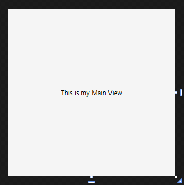
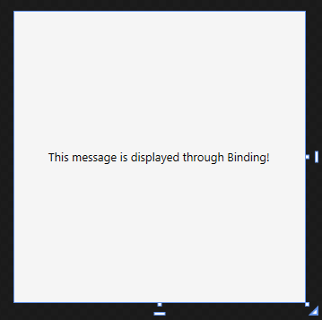

# MVVM in WPF
MVVM stands for Model-View View-Model. The concept behind this is to seperate the business logic and the front-end logic. The front end (```View```) should be responsible for the visuals and only the visuals, and the back-end (```Model```) should be responsible for the logic of that ```Model```, and only the logic. 

The ```View``` and the ```Model``` is connected via a ```ViewModel```. This ```ViewModel``` can be seen as a regulator between the ```View```  and the ```Model```. It dictates where the ```View``` is bound to.

If you want to skip to the tutorial, you are welcome to do so by clicking [here](#tutorial).

## Binding
```Binding``` is a concept where the ```View``` is updated to whatever data is currently in the ```DataContext```, usually either the ```Model``` or the ```ViewModel```. 

The ```DataContext``` isa  very important aspect that you have to understand in ```MVVM```. The datacontext basically tells the ```View``` where to go and look for the data that is bound to it. If the ```DataContext``` is wrong, your ```View``` will not update when the data in your ```Model```/```ViewModel``` has changed. 

A popular tool that is *very* handy in WPF MVVM is called Snoop. I Highly reccomend you get [Snoop](https://snoopwpf.codeplex.com/) to inspect your bindings of your Views to your Models/ViewModels during Runtime.

Lets consider the following example:

You have a form where you have to populate a dropdown with a bunch of teams. Without ```binding```, you will have to assign a name to that Dropdown, and add the teams to that Dropdown during some sort of Initialization of the form:

```cs
constructor() {
    foreach(var team in teams){
        myDropDown.Items.Add(team);
    }
}
```

There is already a problem here. Your logic is dependent on the Front end. If that dropdown is taken out or renamed, it will cause the compilation to fail in the back-end.

 Another problem is that it is tedious to keep track of the selected item, what should be displayed in the Dropdown box when a certain item is selected, etc. the MVVM pattern fixes these problems.

 An example of an MVVM pattern to change the above scenario will be something the line of the following:

### View Implementation

```cs
<ComboBox Height="25" Width="75" ItemsSource="{Binding Teams}" 
    SelectedItem="{Binding SelectedTeam, UpdateSourceTrigger=PropertyChanged}" />
```

Note the ```ItemsSource``` and ```SelectedItem``` properties. They are bound to the datacontext of this user control via ```binding```. The ```ItemsSource``` property tells the ComboBox that it should get its items from the 'Teams' property on the DataContext, and populate the dropdown with the teams.

The ```SelectedItem``` property is bound to the 'SelectedTeam' propety on the DataContext that will be automatically changed when a new team is selected.

### Model Implementation

```cs
private string selectedTeam = "None";
/// <summary>
/// Gets or sets the Selected Team that is selected in the dropdown.
/// </summary>

public string SelectedTeam {
    get { return this.selectedTeam; }
    set {
        if (this.selectedTeam != value) {
            this.selectedTeam = value;
            SetPropertyChanged("SelectedTeam");
        }
    }
}

private ObservableCollection<string> teams = new ObservableCollection<string>();
/// <summary>
/// Gets or sets the Collection of teams that is bound to the Dropdown
/// </summary>

public ObservableCollection<string> Teams {
    get { return this.teams; }
    set {
        if (this.teams != value) {
            this.teams = value;
            SetPropertyChanged("Teams");
        }
    }
}
```

* A few things to note here. Whenever you have a property that is bound to a view, and should update the view when its value is changed, you will have to call '```SetPropertyChanged("")```' with the property Name (case sensitive) as a parameter. This will route all the way back in the Visual tree and find the view that is bound to this model, and update the correct property.

* The 'Team' ```Collection``` is of type ```ObservableCollection```. Whenever you have a collection that is bound to a view, and you want the view to update as soon as the collection has been modified, you can use an ```ObservableCollection```. This is a class implemented by Microsoft to do all the heavy-lifitng of calling the correct change notify on the correct element that has been modified in the collection. Otherwise, the view will not update untill you tell the view to update, by implementing the logic of INotifyPropertyChanged on each element in the collection yourself.

* Bindings to Models *must* have a getter and a setter. It will not work if you have a normal variable that does not have a getter/setter. The Getter/Setters are used to notify the Visual Treeview to update accordingly.

# DataContext

Like I mentioned before, your DataContext is really important in MVVM. It will determine where your View should get the data from. The DataContext can be set in several different ways:

Setting the Datacontext through the View:

Lets say you have the following ```View``` (WPF User Control):

### Xaml:

```cs
<UserControl x:Class="MVVM.Training.Views.MainView"
             xmlns="http://schemas.microsoft.com/winfx/2006/xaml/presentation"
             xmlns:x="http://schemas.microsoft.com/winfx/2006/xaml"
             xmlns:mc="http://schemas.openxmlformats.org/markup-compatibility/2006" 
             xmlns:d="http://schemas.microsoft.com/expression/blend/2008" 
             xmlns:local="clr-namespace:MVVM.Training.Views"
             mc:Ignorable="d" 
             d:DesignHeight="300" d:DesignWidth="300">
    <Grid Background="WhiteSmoke">
        <Label Content="This is my Main View" HorizontalAlignment="Center" VerticalAlignment="Center"/>
    </Grid>
</UserControl>
```

will be represented as: <br>


Currently there is no DataContext for this view, as it has not been set.

---

## Setting the DataContext via the View

Note the following xml Namespace declarations at the top of the xaml:
```cs
x:Class="MVVM.Training.Views.MainView"
```
and 
```cs
xmlns:local="clr-namespace:MVVM.Training.Views"
```

The x:Class declaration tells the view where to find its 'Code-behind' file. You can access this file by pressing 'F7' while selected on your view, and it will jump to the Code Behind File. 

xmlns:local The ```xmlns:local``` declaration just declares a variable where any other views can be found through, if they are created in that namespace. You can access these views by using the namespace prefix 'local':

```cs
<local:MainView> 
    some content...
</local:MainView>
```

lets add another view inside that ```Views``` folder, and see that the AutoComplete picks up this new view in that namespace:


Now, the editor will automatically pick up the new ```View``` in that namespace, and you can add that view as a child view:

.PNG "Team View created in the Views folder")

At this stage, the MainView does not have a DataContext yet, so lets say we want to chagne the message in the view, which is 'This is my Main View' at the moment, to be bound to a message in the ViewModel.

Set your ViewModel up to contain the Message property, in the ViewModels folder:
```cs
using System.ComponentModel;

namespace MVVM.Training.ViewModels {
    public class MainViewModel : INotifyPropertyChanged {
        public MainViewModel() {

        }

        private string message = "This message is displayed through Binding!";
        /// <summary>
        /// Gets or sets the Message to be bound tot the Main view
        /// </summary>

        public string Message {
            get { return this.message; }
            set {
                if (this.message != value) {
                    this.message = value;
                    SetPropertyChanged("Message");
                }
            }
        }


        public event PropertyChangedEventHandler PropertyChanged;
        public void SetPropertyChanged(string propName) {
            var handler = PropertyChanged;
            if (handler != null) {
                handler.Invoke(this, new PropertyChangedEventArgs(propName));
            }
        }

    }
}

```

### You will see the following:
* The MainViewModel is implementing the INotifyPropertyChanged interface which allows the View to be updated when a property changes.
* There is a 'Message' Property with a getter and a setter, which also calls SetPropertyChagned("Message") whenever the property value is set.
* The ```PropertyChagned``` event is added, forced by the ```INotifyPropertyChagned``` interface.
* The ```SetPropertyChanged``` method is implemented, to call the ```PropertyChagned``` event when needed.

### Now to get to the View

```cs
<UserControl x:Class="MVVM.Training.Views.MainView"
             xmlns="http://schemas.microsoft.com/winfx/2006/xaml/presentation"
             xmlns:x="http://schemas.microsoft.com/winfx/2006/xaml"
             xmlns:mc="http://schemas.openxmlformats.org/markup-compatibility/2006" 
             xmlns:d="http://schemas.microsoft.com/expression/blend/2008" 
             xmlns:local="clr-namespace:MVVM.Training.Views"
             xmlns:ViewModels="clr-namespace:MVVM.Training.ViewModels"
             mc:Ignorable="d" 
             d:DesignHeight="300" d:DesignWidth="300" >
    <UserControl.DataContext>
        <ViewModels:MainViewModel />
    </UserControl.DataContext>
    <Grid Background="WhiteSmoke">
        <Label Content="{Binding Message}" HorizontalAlignment="Center" VerticalAlignment="Center"/>
    </Grid>
</UserControl>
```

Make the following changes to the Xaml:
* Add the ```xmlns:ViewModels``` namespace.
* Add the DataContext declaration section in the content of the UserControl:

```cs
    <UserControl.DataContext>
        <ViewModels:MainViewModel />
    </UserControl.DataContext>
```

The above section tells the UserControl to create a new instance of ```MainViewModel``` in the ```ViewModels``` namespace, and use this instance as the ```DataContext```. 

* Change the ```Content``` proeprty of the Label to get the data through Binding on the Message property of the DataContext:
```cs
<Label Content="{Binding Message}" HorizontalAlignment="Center" VerticalAlignment="Center"/>
```

The view should immediately update to reflect this change:



## Setting up the DataContext in Code Behind

At the moment, the Entry point of the application can be seen in the ```App.xaml``` file:

```cs
<Application x:Class="MVVM.Training.App"
             xmlns="http://schemas.microsoft.com/winfx/2006/xaml/presentation"
             xmlns:x="http://schemas.microsoft.com/winfx/2006/xaml"
             xmlns:local="clr-namespace:MVVM.Training"
             StartupUri="MainWindow.xaml">
    <Application.Resources>
         
    </Application.Resources>
</Application>
```

Here you can see the StartupUri tells the compiler that the MainWindow View, found in the local namespace must be used as a startup Entrypoint. We will have to change this a bit.

Remove the StartupUri and go to the code behind in this file, or just open up te App.xaml.cs file, and you will see the following:

```cs
using System.Windows;

namespace MVVM.Training {
    /// <summary>
    /// Interaction logic for App.xaml
    /// </summary>
    public partial class App : Application {
    }
}
```

This class contains nothing yet. So when you run your application after removing the StartupUri, your application won't do anything. We have to override the Startup behaviour to launch the MainView in a window:

```cs
 public partial class App : Application {
    protected override void OnStartup(StartupEventArgs e) {
        base.OnStartup(e);

        var window = new Window() {
            WindowStartupLocation = WindowStartupLocation.CenterScreen
        };
        var mainView = new MainView();
        var mainVM = new MainViewModel();
        mainView.DataContext = mainVM;

        window.Content = mainView;
        window.ShowDialog();
    }
}
```

### We are doing the following:
* Overriding the functionality of the ```OnStartup``` method, to tell the application what needs to happen when the application starts up.
* Create a new instance of '```Window```', to be the main window container of your application.
* Create an instance of your ```MainView```, to use as the content of the ```Window```.
* Create an instance of the ```MainViewModel```, to set as the DataContext for the ```MainView```.
* Set the datacontext of the ```MainView``` to the instance of ```MainViewModel```
* Set the content of the window to the ```MainView```
* Launch the Window using the ```ShowDialog``` method.

> How to set the datacontext is entirely up to you, but I prefer to di it in code behind as it feels to me as if you have more control over what you are doing there, than through xaml - especially if you are new to WPF and MVVM.

## Now you have the basic understanding of MVVM, and can start the Training Application.

---

# Tutorial

This tutorial will create multiple ```Views```, ```ViewModels``` and ```Models``` that will be bound together, and ultimatly create a basic application that will allow a user to create and manage teams for an organization.

1. Create a RelayCommand class that will be used to execute commands bound by the Views (Don't worry too much about the implementation of the RelayCommand class, just copy and paste):
```cs
    public class RelayCommand : ICommand {
        private readonly Func<object, bool> canExecute;
        private readonly Action<object> execute;
        /// <summary>
        ///     Initializes a new instance of the <see cref="DelegateCommand" /> class.
        /// </summary>
        /// <param name="executeAction">The action to execute.</param>
        public RelayCommand(Action<object> executeAction)
            : this(executeAction, null) {
        }

        /// <summary>
        ///     Initializes a new instance of the <see cref="DelegateCommand" /> class.
        /// </summary>
        /// <param name="executeAction">The action to execute.</param>
        /// <param name="canExecuteFunction">The function that evaluates if the command can execute or not.</param>
        public RelayCommand(Action<object> executeAction, Func<object, bool> canExecuteFunction) {
            execute = executeAction;
            canExecute = canExecuteFunction;
        }

        /// <summary>
        ///     Occurs when changes occur that affect whether or not the command should execute.
        /// </summary>
        public event EventHandler CanExecuteChanged;

        /// <summary>
        ///     Raises the can execute changed.
        /// </summary>
        public void RaiseCanExecuteChanged() {
            if (CanExecuteChanged != null) {
                CanExecuteChanged(this, EventArgs.Empty);
            }
        }

        /// <summary>
        ///     Defines the method that determines whether the command can execute in its current state.
        /// </summary>
        /// <param name="parameter">
        ///     Data used by the command.  If the command does not require data to be passed, this object can
        ///     be set to null.
        /// </param>
        /// <returns>
        ///     true if this command can be executed; otherwise, false.
        /// </returns>
        public virtual bool CanExecute(object parameter) {
            if (canExecute == null) {
                return true;
            }

            return canExecute(parameter);
        }

        /// <summary>
        ///     Defines the method to be called when the command is invoked.
        /// </summary>
        /// <param name="parameter">
        ///     Data used by the command.  If the command does not require data to be passed, this object can
        ///     be set to null.
        /// </param>
        public virtual void Execute(object parameter) {
            execute(parameter);
        }
    }
```

2. Create a base class that will implement common functions that will be used throughout all the ```Model```/```ViewModel``` classes:

```cs
    public abstract class ModelBase : INotifyPropertyChanged {
        protected ICommand CreateCommand(Action<object> executeAction) {
            if (executeAction == null)
                throw new ArgumentNullException("executeAction");

            return new RelayCommand(executeAction);
        }

        public void InvokeOnUIThread(Action action) {
            if (Application.Current == null) throw new NullReferenceException("No instance of the Current Application can be found");
            if (Application.Current.Dispatcher == null) throw new NullReferenceException("The Dispatcher of the Current Application is null");
            Application.Current.Dispatcher.Invoke(action);
        }

        public event PropertyChangedEventHandler PropertyChanged;
        public void SetPropertyChanged(string propName) {
            var handler = PropertyChanged;
            if (handler != null) {
                handler.Invoke(this, new PropertyChangedEventArgs(propName));
            }
        }
    }
```